<h2 align="center"> <strong>▪ 30 dias de CSS🖌▪ </strong></h2>

### 📚Sobre

O desafio ***30 dias de CSS*** visa ajudá-lo a melhorar suas habilidades de codificação em *HTML5* e *CSS3* com a a prática de programação na criação de mini projetos diários.   

---
### 🎯Objetivo

Criar pequenos projetos com *HTML* E *CSS* durante 30 dias.

---

### 💣Desafios diários

- Desafio 1 - Ícone de mídia social em camadas 

  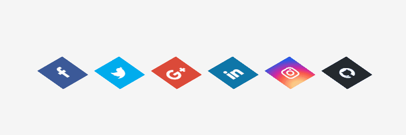

 

- Desafio 2 - Loader Animado

  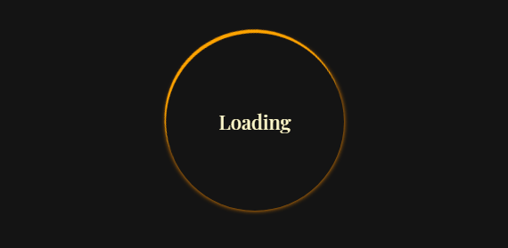

 

- Desafio 3 - Mudança de cor de texto quando entra em outra div

  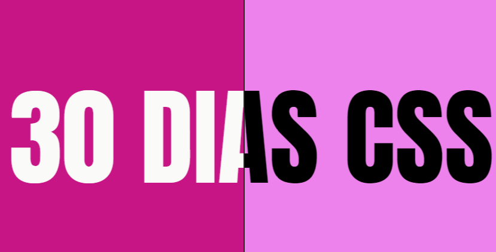

 

- Desafio 4 - Botão com efeito

  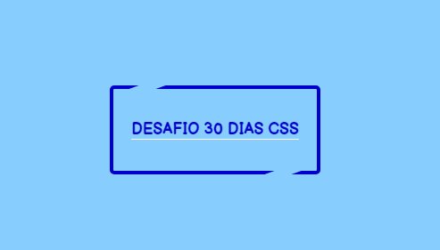

 

- Desafio 5 - Efeito pulsar

  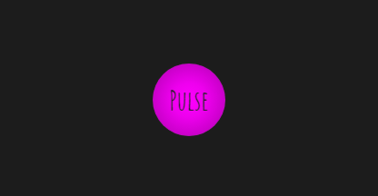

 

- Desafio 6 - Efeito Lightning Text

  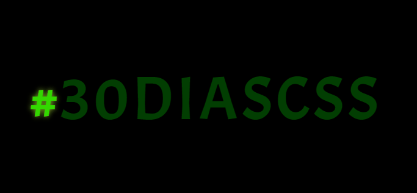

 

- Desafio 7 - Preloader Animado

  

 

- Desafio 8 - Coração Batendo

  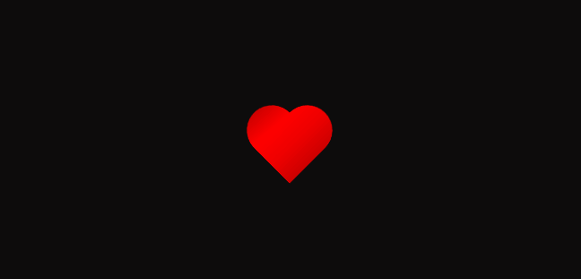

 

- Desafio 9 - Pêndulo de Newton

  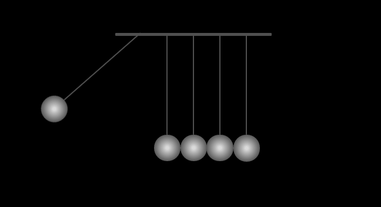

 

- Desafio 10 - Animação Texto Alternando

  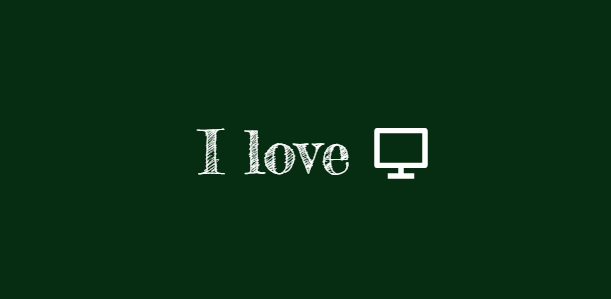

 

- Desafio 11 - Botão com Efeito Hover

  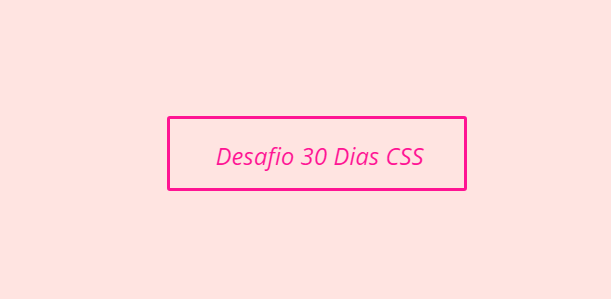

 

- Desafio 12 - Efeito de Preenchimento ao passar o mouse

  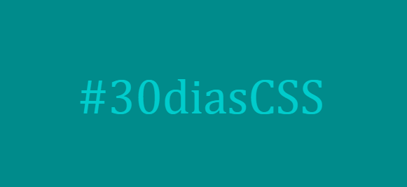

 

- Desafio 13 - Loading com Efeito Ondas

  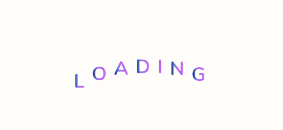

 

- Desafio 14 - Fundo de texto animado

  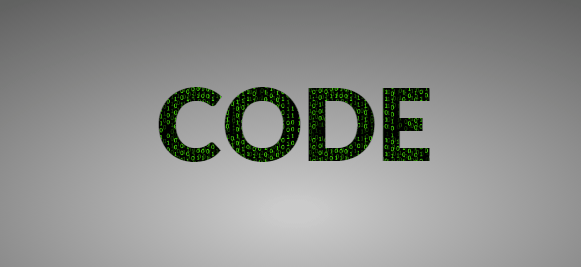

 

- Desafio 15 - Efeito Flutuante

  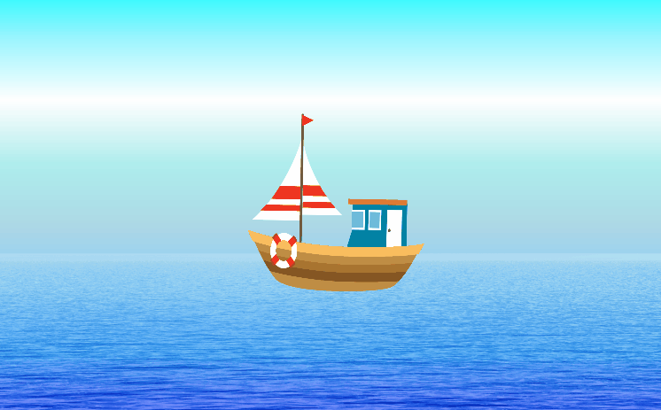

 

- Desafio 16 - Botão com Efeito Checked

  

 

- Desafio 17 - Loader Animado (Efeito Flip)

  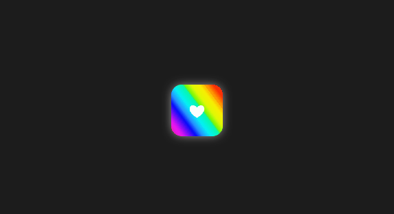

 

- Desafio 19 - Background Animado - Caixas Flutuantes

  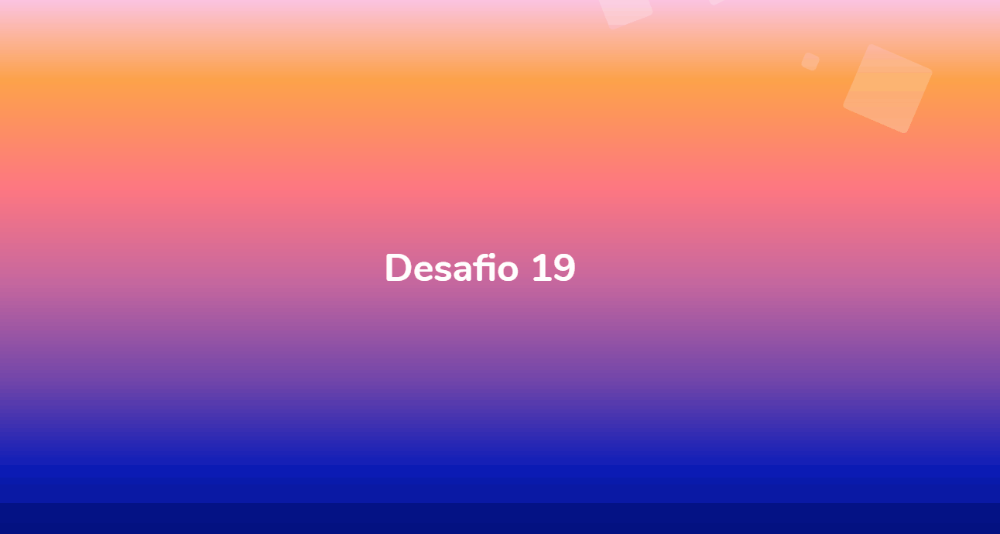

 

- Desafio 20 - Botão com Efeito para Ajuda/Informação

  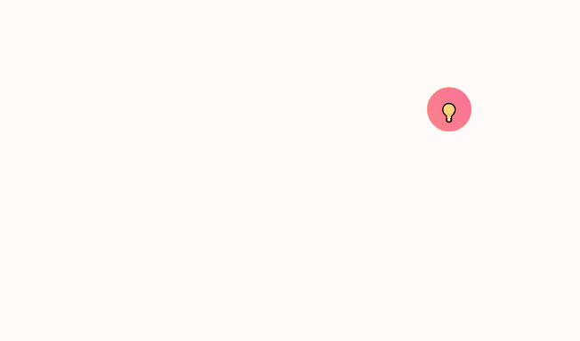

 

- Desafio 21 - Efeito Loading

  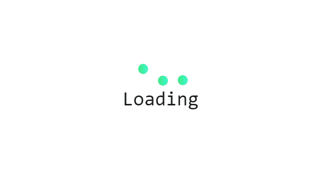

 

- Desafio 22 - Menu Hamburguer

  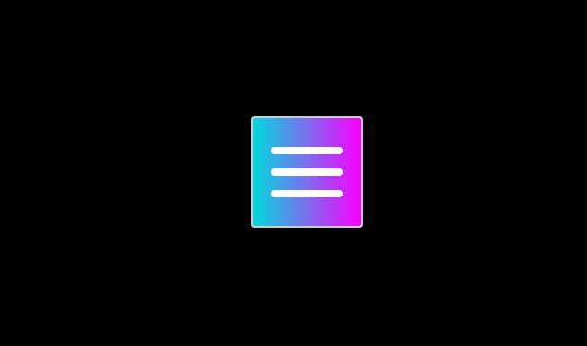

 

- Desafio 23 - Botão Efeito Liquid Fill

  

 

- Desafio 24 - Flor Spinner

  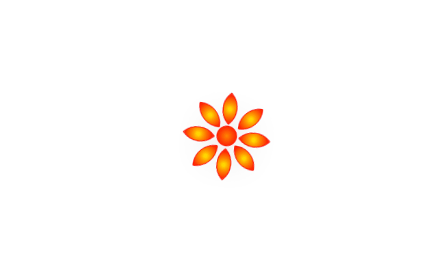

 

- Desafio 25 - Checkbox Animado - Efeito Neon

  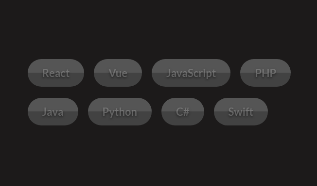

 

- Desafio 26 - Loading Diamante

  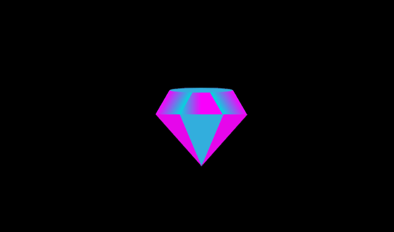

 

- Desafio 27 - Efeito Fade em Textos

  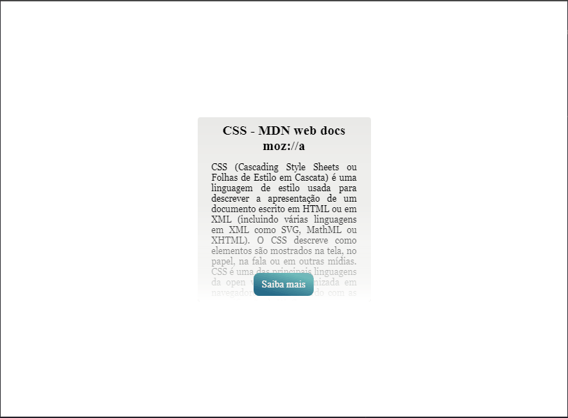

 

- Desafio 28 - Transição de Cores no Background

  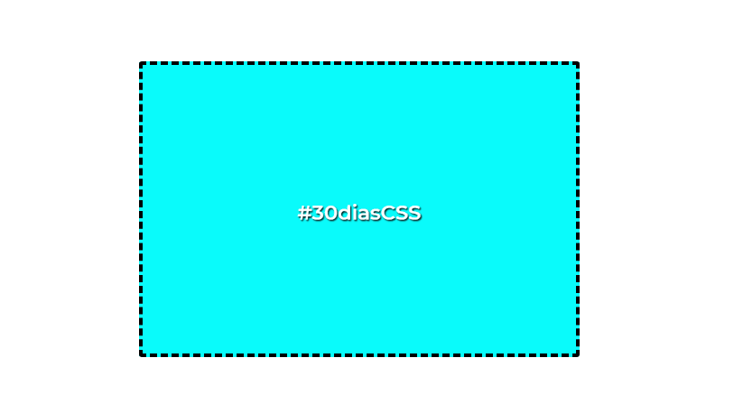

 

- Desafio 29 - Efeito Texto Gradiente

  

 

- Desafio 30 - Efeito Partículas

  

 
---

Desenvolvido com ❤ por Polyane Tuag
